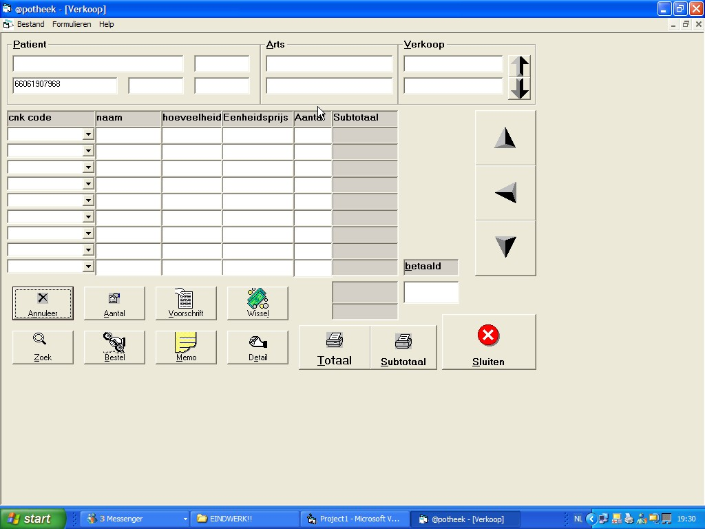



## aphotheek \(farmecy\)

### Description

it is a program for farmecy dat make new clients and used for selling medication also you can see de doktor of the patient
 
### More Info
 
this is a program i made for my endexam in evening school

             |
---                |---
**Submitted On**   |2004-05-15 21:15:00
**By**             |[peter van geit](https://github.com/Planet-Source-Code/PSCIndex/blob/master/ByAuthor/peter-van-geit.md)
**Level**          |Beginner
**User Rating**    |5.0 (15 globes from 3 users)
**Compatibility**  |VB 6\.0
**Category**       |[Complete Applications](https://github.com/Planet-Source-Code/PSCIndex/blob/master/ByCategory/complete-applications__1-27.md)
**World**          |[Visual Basic](https://github.com/Planet-Source-Code/PSCIndex/blob/master/ByWorld/visual-basic.md)
**Archive File**   |[aphotheek\_201099842006\.zip](https://github.com/Planet-Source-Code/peter-van-geit-aphotheek-farmecy__1-66181/archive/master.zip)

